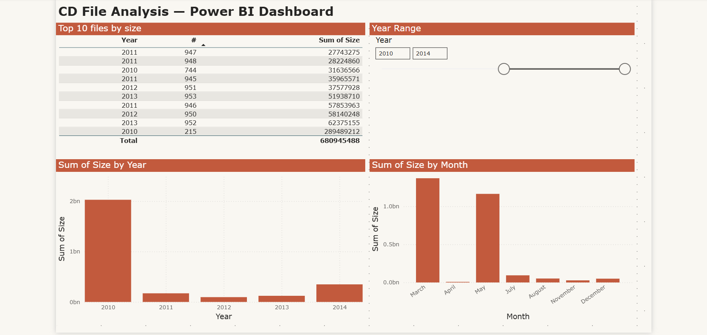
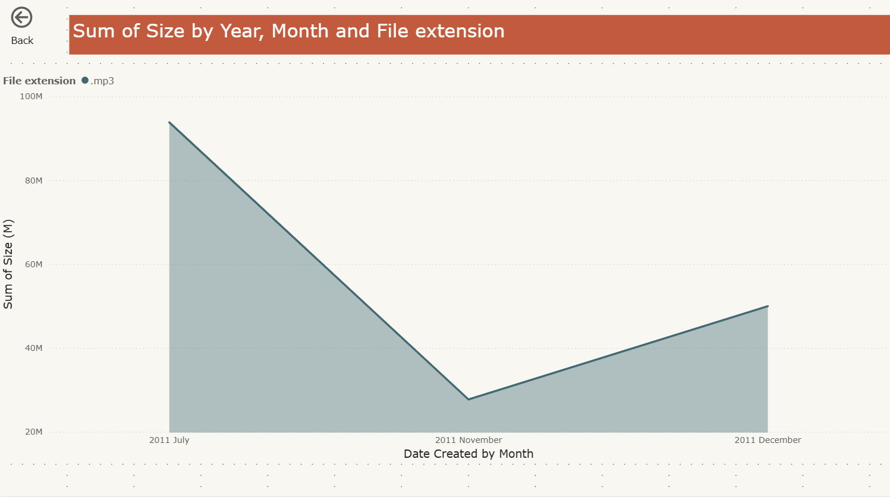

# CD File Analysis — Power BI Dashboard

An interactive Power BI report that analyzes a library of CD/audio file metadata
(size, creation date, and file extension) and lets users explore the data
through slicers, bookmarks, and drill-through navigation. Built in Power BI
Desktop.

---

## Dashboard overview

The main **Dashboard** page summarizes the file library: the ten largest files,
size totals by year, and size totals by month. A year-range slicer filters the
whole page, and saved bookmarks jump between preset year ranges.

## Drill-through detail

Right-clicking any year on the Dashboard drills through to a **Breakdown by
month** page, automatically filtered to that year. Here, 2011 is broken down
month by month and split by file extension — showing that its `.mp3` files
peaked in July and tapered toward year-end.

---

## What this report delivers

- **Instant view of the biggest storage consumers.** The Top 10 table surfaces
  the ten largest files at a glance, with a single 2010 file (289M) dwarfing the
  rest of the library.
- **Time-based patterns made visible.** Year and month breakdowns reveal when
  file creation and storage growth concentrated — 2010 dominates by year, while
  March and May lead by month.
- **Self-service exploration.** A year-range slicer plus three saved bookmarks
  let viewers re-scope the whole page without editing anything.
- **Guided drill-down.** Drill-through takes a viewer from a high-level year
  straight to its month-by-month detail, filtered automatically.

## Skills demonstrated

| Capability | How it's used in this report |
|------------|------------------------------|
| Data tables & summarization | Top 10 table with item-level rows and a grand total |
| Top N filtering | Table filtered to the ten largest files by size |
| Sorting | Table ordered by size, largest first |
| Slicers | Year-range slicer controlling the page |
| Bookmarks | Three saved views (2010–2014, 2006–2009, all years) |
| Date hierarchies | Year → Month drill-down on the area chart |
| Drill-through | Right-click a year to open its monthly detail page |
| Report styling | Frontier theme, formatted titles, data labels, axis formatting |

---

## How to explore the report

1. Open the `.pbix` file in Power BI Desktop.
2. On the **Dashboard** page, drag the year-range slicer or apply a bookmark to
   re-scope the visuals.
3. Right-click any year in a chart and choose **Drill through → Breakdown by
   month** to see that year's monthly detail.
4. Use the **Back** button on the detail page to return to the Dashboard.

---

*Built with Power BI Desktop. Dataset: CD/audio file metadata (size, date
created, file extension).*
